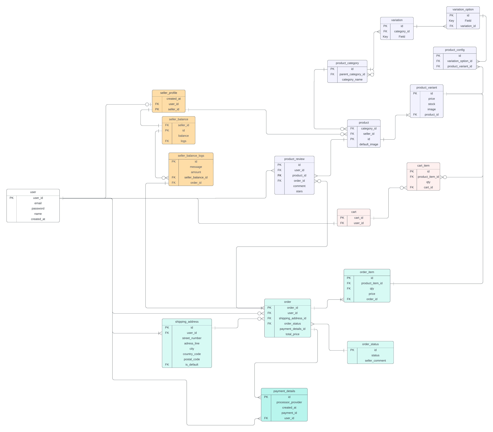
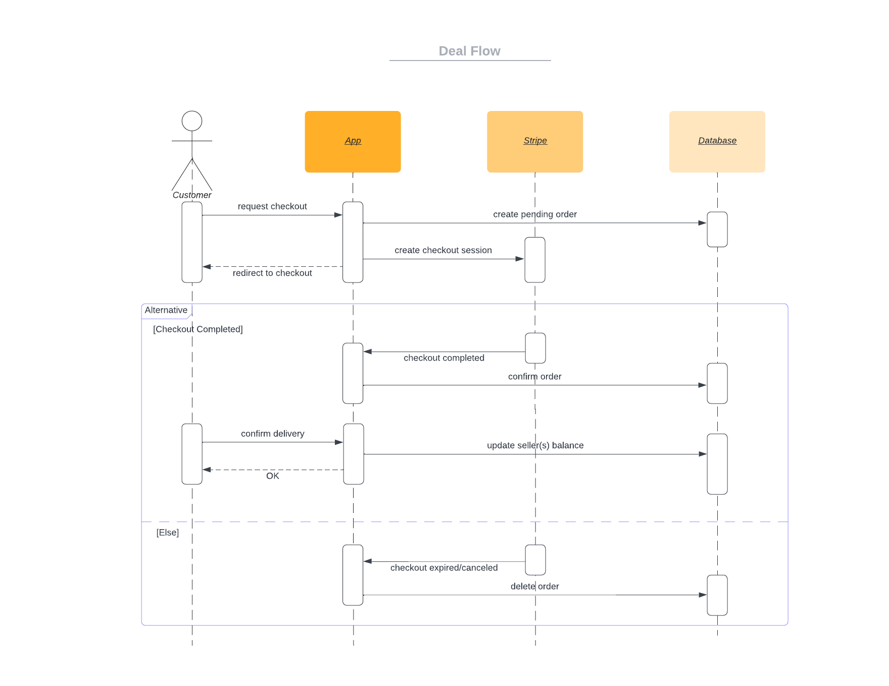

# E-Commerce Node.js App

## Introduction

A C2C (Customer-to-Customer) E-commerce Application project. This project is a demonstration of an e-commerce platform that enables consumers to sell and buy from each other.

**Note:** This project is for educational purposes only.

### Business Requirements

[Doc](./requirements.md)

### Project Milestones

[Doc](./milestone.md)

### Top Challanges Solved

[Doc](./challanges.md)

## Project Architecture And Design

### ERD

### Diagrams

