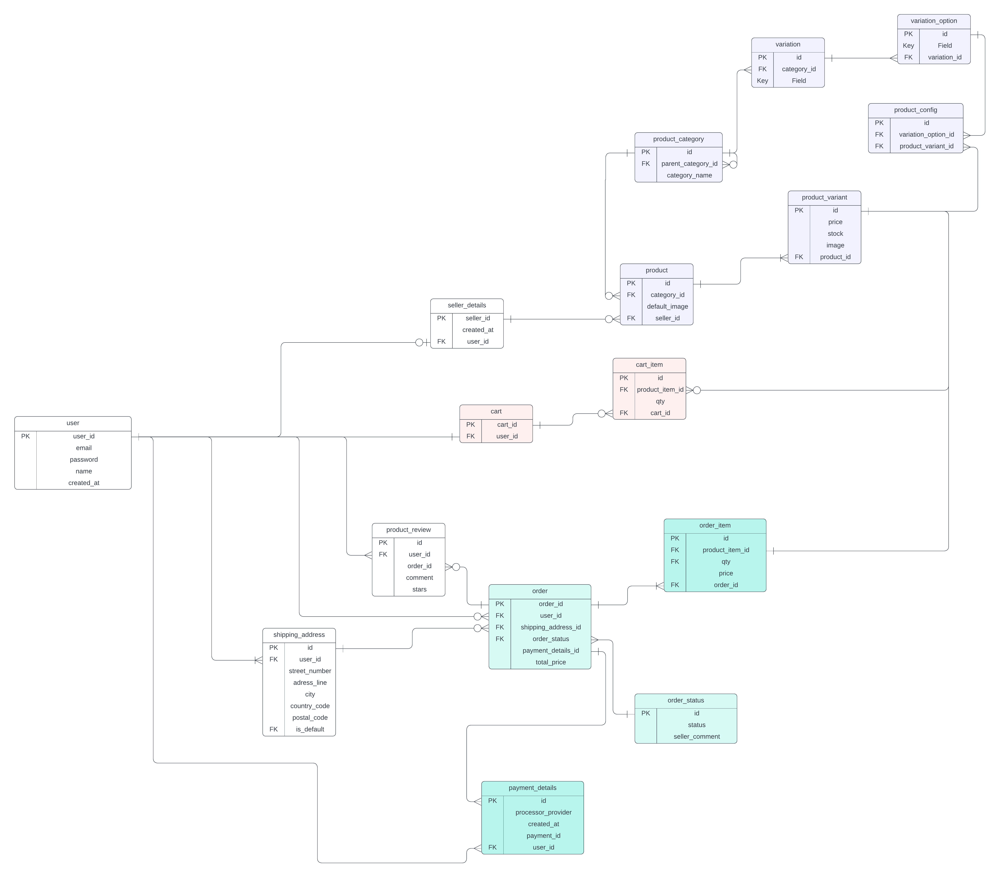

# E-Commerce Node.js App

## Introduction
A C2C (Customer-to-Customer) E-commerce Application project. This project is a demonstration of an e-commerce platform that enables consumers to sell and buy from each other. 

**Note:** This project is for educational purposes only.
### Business Requirements
[Business Requirements](./requirements.md)

### ERD

## Top challanges encountered
- Reserving Orders: the problem comes when the user creates a checkout session as the product could be out-of-stock while the user is still completing his checkout process, not only this, but also the delay until the payment processor notices the server that the payment is done. This can actually be considered a business problem not a software problem. For this, I decided to go with order reservation to eradicate the possibility of the product stock problem.
